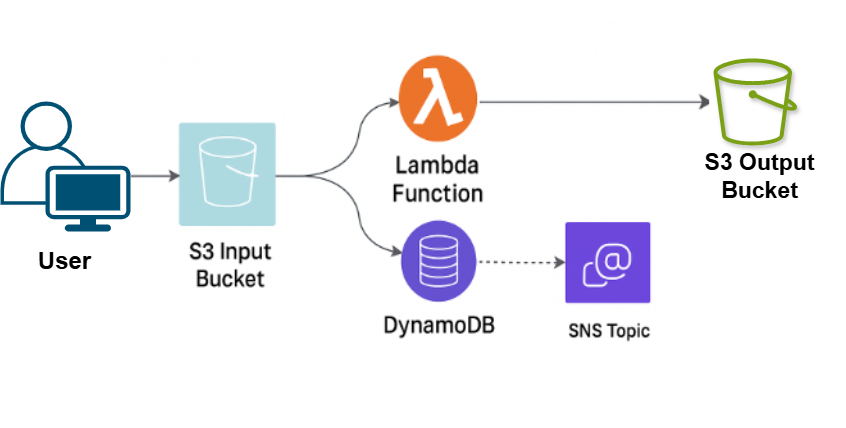

# Serverless Image Compression Pipeline (AWS Lambda + Pillow)

## 📌 Overview
This project implements a **serverless image compression pipeline** using AWS Lambda and Pillow.  
When a new image is uploaded to an **Input S3 Bucket**, the Lambda function automatically compresses the image and stores it in the **Output S3 Bucket**.  
Metadata is saved in **DynamoDB**, and a notification is published to **SNS**.

## Architecture


**Flow:**
1. Upload image to **Input S3 Bucket**.
2. **Lambda function** is triggered.
3. Lambda uses **Pillow** to compress the image.
4. Compressed image is stored in **Output S3 Bucket**.
5. Metadata is saved in **DynamoDB**.
6. Notification is sent via **SNS**.

## 🛠️ Tech Stack
- **AWS Lambda** (Python 3.11)
- **AWS S3** (Input & Output Buckets)
- **AWS DynamoDB** (Metadata storage)
- **AWS SNS** (Notifications)
- **Pillow** (Python Imaging Library)

## 📂 Project Structure
├── Doc/                     

│   ├── Architecturev1.png   # Serverless pipeline architecture

│   ├── image1.png           # Screenshots of pipeline execution

│   ├── image2.png          


│   ├── image3.png           

│   └── image4.png           

├── lambda_function.py       # Main Lambda function

├── pillow-layer.zip         # Custom Lambda layer with Pillow (Amazon Linux build)

└── README.md                # Documentation


## ⚙️ Setup Instructions
1. **Create resources**:
   - Input S3 bucket
   - Output S3 bucket
   - DynamoDB table (Partition Key: `ImageID`)
   - SNS Topic

2. **Deploy Lambda**:
   - Runtime: Python 3.11
   - Add environment variables:
     - `OUTPUT_BUCKET`
     - `DYNAMODB_TABLE`
     - `SNS_TOPIC_ARN`
   - Attach the **Pillow Lambda layer**.
   - Grant permissions: `S3`, `DynamoDB`, `SNS`.

3. **Test**:
   - Upload an image to the input bucket.
   - Verify compressed image in output bucket.
   - Check DynamoDB for metadata.
   - Check SNS for notification.

## Example Metadata Stored
```json
{
  "ImageID": "example.jpg",
  "OriginalBucket": "input-bucket-123",
  "OutputBucket": "output-bucket-123",
  "CompressedFile": "compressed-example.jpg",
  "SizeKB": 83,
  "Timestamp": "2025-09-09T20:22:08.885477"
}
```
## Challenges & Lessons Learned

This project wasn’t smooth sailing, here are the major struggles I faced and how I solved them:

### 1. **Pillow Library Nightmare**
- **Problem:** Pillow is not natively supported in AWS Lambda’s runtime.  
  At first, I tried adding it with `pip install pillow -t .` locally and zipping it, but it failed on Lambda because **my local machine (Windows)** compiled dependencies differently than **Lambda’s Amazon Linux environment**.  
- **Attempts:**  
  - Tried AWS prebuilt Pillow layers → versions didn’t match.  
  - Tried packaging manually → kept hitting `cannot import _imaging` errors.  
  - Finally, I spun up an **Amazon Linux EC2 instance**, installed Python 3.11, and ran `pip install pillow -t ./python`. That way, the library was compiled in the **same environment as Lambda**.  
  - Downloaded the folder back to my local machine, zipped it into a **Lambda Layer**, and attached it to the function.
- **Lesson Learned:**  
  - Lambda requires **Amazon Linux-compatible builds** for dependencies with native binaries.  
  - Sometimes the easiest fix is to **replicate the Lambda runtime in EC2** and build from there.  
  - This taught me the importance of **environment parity** in serverless deployments.  

### 2. **S3 Permissions Errors**
- **Problem:** Got `AccessDenied` and `403` errors when trying to access buckets.  
- **Fix:** Updated the **Lambda execution role** with proper `s3:GetObject`, `s3:PutObject`, and `s3:ListBucket` permissions for both input and output buckets.

### 3. **404 HeadObject Not Found**
- **Problem:** Lambda threw a `HeadObject 404` error because the test event had a mismatch in object key/bucket.  
- **Fix:** Adjusted the **test event JSON** to exactly match the uploaded S3 object and confirmed the event structure.

### 4. **Event Testing Confusion**
- **Problem:** I initially tested with random JSON, which failed because it didn’t replicate a real S3 event.  
- **Fix:** Used **actual S3 Put event JSON** to simulate real uploads in the Lambda console.

### 5. **Compression Testing**
- **Problem:** Unsure if Pillow was really compressing images.  
- **Fix:** Added debug logs to check **file size before and after compression**, then validated with metadata saved in DynamoDB.

### 6. **Cold Start Latency**
- **Problem:** First Lambda runs were slow due to **init duration** from Pillow.  
- **Fix:** Optimized Pillow imports and minimized dependencies so Lambda stays lightweight.

---


